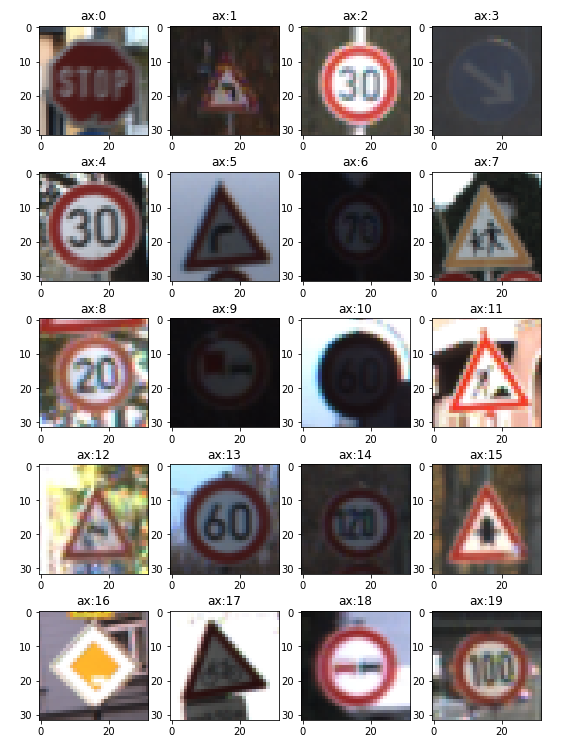
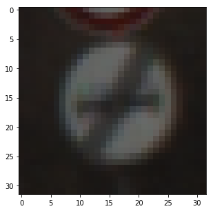
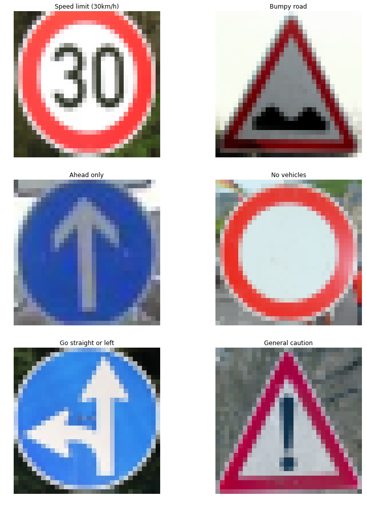
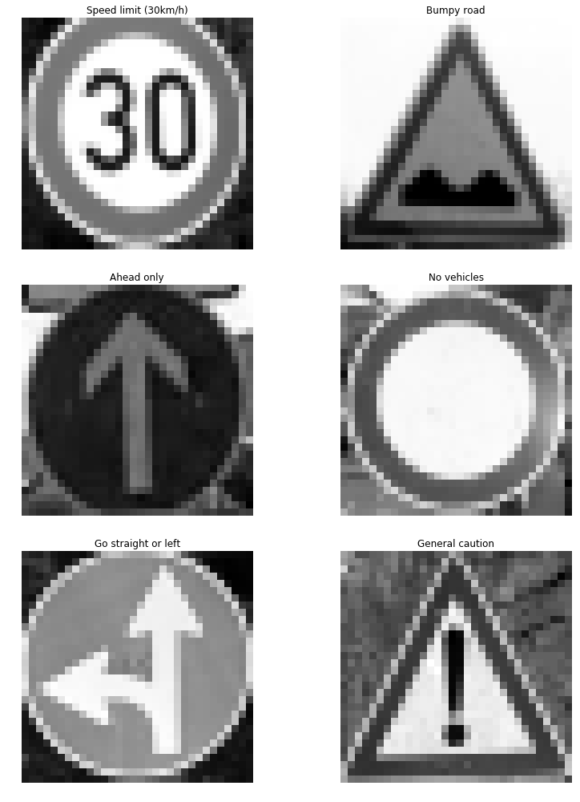

# **Traffic Sign Recognition** 

## Writeup

---

**Build a Traffic Sign Recognition Project**

The goals / steps of this project are the following:

* step 0: Image of German traffic sign
  * step 0.1: Load pickled dataset
  * step 0.2: Perform the initial sanity check to see if the images are correct. 
* step 1: Design and test a model architecture
  * step 1.1: Pre-process image (normalization, grayscale,etc.)
  * step 1.2: Include an exploratory visualization of the dataset
    * step 1.2.1: Convoluted image example
    * step 1.2.2: Maxpooling image example 
* step 2: Design and test a model architecture
  * step 2.1: Model parameter/function definition 
  * step 2.2: Model training/validation
* step 3: Test the model with new images
  * step 3.1: Load example of new images
  * step 3.2: pre-processing image(graying/normalization)
  * step 3.3: Sanity check- Prediction of sign type for an image
  * step 3.4: Analyze performance
  * step 3.5: Output to 5 softmax probability for each image found the web

[//]: # (Image References)

[image1]: ./mysigns/visualization.jpg "Visualization"
[image2]: ./examples/grayscale.jpg "Grayscaling"
[image3]: ./examples/random_noise.jpg "Random Noise"
[image4]: ./examples/placeholder.png "Traffic Sign 1"
[image5]: ./examples/placeholder.png "Traffic Sign 2"
[image6]: ./examples/placeholder.png "Traffic Sign 3"
[image7]: ./examples/placeholder.png "Traffic Sign 4"
[image8]: ./examples/placeholder.png "Traffic Sign 5"

## Rubric Points
### Here I will consider the [rubric points](https://review.udacity.com/#!/rubrics/481/view) individually and describe how I addressed each point in my implementation.  

---

This is the Python jupyter code:
[project code](https://github.com/SeokLeeUS/TrafficSignIdentifier/blob/master/Traffic_Sign_Classifier-04-Image_Pre-processing_submission_00.ipynb)

### Data Set Summary & Exploration

#### 1. Provide a basic summary of the data set. In the code, the analysis should be done using python, numpy and/or pandas methods rather than hardcoding results manually.

* Load pickled data (of which data type is dict) and extract train/valid/test dataset of German traffic sign.

```python
X_train, y_train = train['features'], train['labels']
print('X_train.shape:',X_train.shape)
X_valid, y_valid = valid['features'], valid['labels']
print('X_valid.shape:',X_valid.shape)
X_test, y_test = test['features'], test['labels']
print('X_test.shape:',X_test.shape)
```

* In order to examine images, plot German signs randomly. 

```python
index = random.randint(0, len(X_train))
print('random index',index)
image = X_train[index].squeeze()
print('image.shape:',image.shape)

w = 10
h = 10
fig = plt.figure(figsize=(9, 13))
columns = 4
rows = 5
ax = []

for i in range( columns*rows ):
    #img = np.random.randint(10, size=(h,w))  
    index = random.randint(0, len(X_train))
    img = X_train[index].squeeze()
    
    # create subplot and append to ax
    ax.append( fig.add_subplot(rows, columns, i+1) )
    ax[-1].set_title("ax:"+str(i))  # set title
    plt.imshow(img)

plt.show()  # finally, render the plot
```



* Obtain the number of images by using pandas read_csv attribute and extract other number of image datsets:

```python
import pandas as pd
my_csv = pd.read_csv('signnames.csv')
ClassId_Name = my_csv.ClassId
Sign_Name = my_csv.SignName

print(len(ClassId_Name))
```

```python
n_train = len(X_train)
n_validation = len(X_valid) 
n_test = len(X_test)
image_shape = X_train.shape
n_classes = len(ClassId_Name)

print("Number of training examples =", n_train)
print("Number of testing examples =", n_test)
print("Image data shape =", image_shape)
print("Number of classes =", n_classes)

.
.
.
Number of training examples = 34799
Number of testing examples = 12630
Image data shape = (34799, 32, 32, 3)
Number of classes = 43

```

#### 2. Data visualization

Here is an exploratory visualization of the data set. It is a bar chart showing how the data ...


### Design and Test a Model Architecture

#### 1. Design and implement a deep learning model that learns to recognize traffic signs. Train and test your model on the [German Traffic Sign Dataset](http://benchmark.ini.rub.de/?section=gtsrb&subsection=dataset)

There are  things to consider:
- preprocessing techniques (normalization, graying out, centralization, standardization, whitening)
- Neural network architecture
- [Hyper parameters](https://en.wikipedia.org/wiki/Hyperparameter_(machine_learning))
  - batch/epoch size
  - learning rate

  * Pre-process the image- (normalization, grayscale)

    - For the entire training data, make sure that the average value for each pixel is zero. That is, add the whole image, divide it by the number to get the 'average image', and subtract this image from all the images. This course is almost necessary! If you subtract 127.5 from 0 to 255 in the image and set the average to zero (called as centering), the dynamic range is too large to train. To do this, you can simply resize it. If you have a value between [0, 255], you can divide it by 255 and change it to a value between [0, 1]. [0, 1] is later compared to the output of Relu function. https://deepestdocs.readthedocs.io/en/latest/003_image_processing/0030/
    
    - In terms of grayingscale pre-processing, image classification in this project doesn't necessarily deal with color channel. In order to cut down complexity which in turn resulted in consuming computing power, graying out is chosen:

```python
# normalization for pre-processing
def normCNN(X):
    X = X.reshape(X.shape[0], X.shape[1]*X.shape[2]*X.shape[3])
    # normalization
    X_norm = (X-255)/255
    # centeralization
    #X_norm = X_norm - X_norm.mean(axis=0)
    # standardization
    #X_norm = X_norm/np.std(X_norm, axis = 0)
    # rescaling to set between 0 and 1    
    return X_norm
```

```python
# graying out
#X_train_gray = np.sum(X_train/3, axis=3, keepdims=True)
X_train = X_train.mean(axis=-1,keepdims=1) 
X_valid = X_valid.mean(axis=-1,keepdims=1)
X_test = X_test.mean(axis=-1,keepdims=1)
X_train.shape

```

Here is an example of a traffic sign image before and after grayscaling and normalization

- raw image:

 

- normalized image:

 

- grayscaling& normalizated image:

 

* Include an exploratory visualization of the dataset

A. examine convoluted images:
```python

sess = tf.InteractiveSession()
#img = img.reshape(-1,28,28,1)
W1 = tf.Variable(tf.random_normal([3,3,1,5],stddev = 0.01))
conv2d = tf.nn.conv2d(img_reshape,W1,strides = [1,2,2,1],padding = 'SAME')
print(conv2d)
sess.run(tf.global_variables_initializer())
conv2d_img = conv2d.eval()
conv2d_img = np.swapaxes(conv2d_img,0,3)
for i, one_img in enumerate(conv2d_img):
    # plt.subplot(1,5,i+1), plt.imshow(one_img.reshape(14,14),cmap ='gray')
    plt.subplot(2,5,i+1), plt.imshow(one_img.reshape(16,16),cmap ='gray')
```
 

B. examine maxpool images:
```python

# check maxpooling image
# max pool image
pool = tf.nn.max_pool(conv2d,ksize=[1,2,2,1],strides=[1,2,2,1],padding='SAME')
print(pool)
sess.run(tf.global_variables_initializer())
pool_img = pool.eval()
pool_img = np.swapaxes(pool_img,0,3)
for i, one_img in enumerate(pool_img):
    plt.subplot(1,5,i+1),plt.imshow(one_img.reshape(8,8),cmap = 'gray')
```
 

#### 2. Describe what your final model architecture looks like including model type, layers, layer sizes, connectivity, etc.) Consider including a diagram and/or table describing the final model.

My final model consisted of the following layers:

| Layer         		|     Description	        					| 
|:---------------------:|:---------------------------------------------:| 
| Input         		| 32x32x1 Gray image   							| 
| Convolution 3x3     	| 1x1 stride, same padding, outputs 32 hidden layers 	|
| RELU					|												|
| Max pooling	      	| 2x2 stride				|
| Convolution 3x3	    | 1x1 stride, same padding, outputs 64 hidden layers      									|
| RELU					|												|
| Max pooling	      	| 2x2 stride 				|
| Fully connected		|
| dropout | 0.5 drop out rate|
| Softmax				|       									|


```python

def LeNet2(X):
    
    L1 = tf.layers.conv2d(X,32,[3,3],activation=tf.nn.relu,padding = 'SAME')
    #print(L1)
    L1 = tf.layers.max_pooling2d(L1,[2,2],[2,2],padding = 'SAME')
    # Feb202019 adding drop out on the first hidden layer 
    #L1 = tf.layers.dropout(L1,0.7,is_training)
    #print(L1)
    #W1 = tf.Variable(tf.random_normal([3,3,1,32],stddev = 0.01))
    #L1 = tf.nn.conv2d(x,W1,strides = [1,1,1,1],padding = 'SAME')
    #L1 = tf.nn.relu(L1)
    #L1 = tf.nn.max_pool(L1,ksize=[1,2,2,1],strides = [1,2,2,1],padding = 'SAME')
    #L1 = tf.nn.dropout(L1,keep_prob)
    
    L2 = tf.layers.conv2d(L1,64,[3,3],activation= tf.nn.relu,padding = 'SAME')
    #print(L2)
    L2 = tf.layers.max_pooling2d(L2,[2,2],[2,2],padding = 'SAME')
    L2 = tf.layers.dropout(L2,0.7,is_training)
    
    
    #L3 = tf.layers.conv2d(L1,128,[3,3],activation= tf.nn.relu,padding = 'SAME')
    #print(L3)
    #L3 = tf.layers.max_pooling2d(L3,[2,2],[2,2],padding = 'SAME')
    #print(L3)
    

    L3 = tf.contrib.layers.flatten(L2)
    #print(L4)
    L3 = tf.layers.dense(L3,256,activation = tf.nn.relu)
    #print(L4)
    L3 = tf.layers.dropout(L3,0.5,is_training)
    
    logits = tf.layers.dense(L3,n_classes,activation = None)
    #print(model)
    
    return logits


```

#### 3. Describe how you trained your model. The discussion can include the type of optimizer, the batch size, number of epochs and any hyperparameters such as learning rate.

| Characteristics        		|     Description	        					| 
|:---------------------:|:---------------------------------------------:| 
| Optimizer        		| AdamOptimizer   							| 
| Batch size     	|  100 	|
| Epoch size					|		25										|
| Learning rate	      	| 0.001				|

#### 4. Describe the approach taken for finding a solution and getting the validation set accuracy to be at least 0.93. Include in the discussion the results on the training, validation and test sets and where in the code these were calculated. Your approach may have been an iterative process, in which case, outline the steps you took to get to the final solution and why you chose those steps. Perhaps your solution involved an already well known implementation or architecture. In this case, discuss why you think the architecture is suitable for the current problem.

My final model results were:
* training set accuracy of 1
* validation set accuracy of 0.954 

| Data set        		|     Accuracy	        					| 
|:---------------------:|:---------------------------------------------:| 
| Training       		| 1  							| 
| Validation    	|  0.954 	|

If an iterative approach was chosen:
* The first chosen architecture: 2 conv+2 max pool+ 1 FC
  * Issue with the first architecture: poor accuracy, obviously.
  * Issue details: 
     I faced both under fitting and over-fitting( validation dataset resulted in poor accuracy)
     The following changes were made to tackle the issue:
       a. added a drop-out at FC
       b. adjusted batch,epoch/learning rate
       c. improved image pre-processing

* Steps to improve the accuracy:
  - Found mistakes on normalization equation. 
  - Found validation dataset also needs to be pre-processed. 
  - Found batch size increases, I am facing memory issue.... 
  - I added drop out on FC, it improves a bit, but not that much. The gross improvement arrived by adjusting image pre-processing on validation data set and fixing wrong pre-processing equation. 

* Further improvement (or things I could try) and questions to seek by myself:

  - Adding more hidden layers, and increase number of layers
  - how can I characterize what hyperparameter can influence more on the accuracy performance
  - try to implement reknown architecture like AlexNet to see what benefit I can take. 
  - need to explore more about image pre-processing ( at the end of the day, it's all driven by how to extract and polish the image to feed in CNN)
  - I need to learn more matplotlib to visualize data. 

### Test a Model on New Images

#### 1. Choose German traffic signs found on the web and provide them in the report. For each image, discuss what quality or qualities might be difficult to classify.

* Here are random German traffic signs that I found on the web:



* After pre-processing:




```python
my_signs = np.array(my_signs)
my_signs_gray = np.sum(my_signs/3, axis=3, keepdims=True)
my_signs_normalized = my_signs_gray/255-1
```

#### 2. Discuss the model's predictions on these new traffic signs and compare the results to predicting on the test set. At a minimum, discuss what the predictions were, the accuracy on these new predictions, and compare the accuracy to the accuracy on the test set (OPTIONAL: Discuss the results in more detail as described in the "Stand Out Suggestions" part of the rubric).

* Here are the results of the prediction:

| Image			        |     Prediction	        					| 
|:---------------------:|:---------------------------------------------:| 
| Speed limit(30km/h)     		| Speed limit(30km/h)   									| 
| Bumpy road     			| Bumpy road 										|
| Ahead only 					| Ahead only 										|
| No vehicles	      		| No vehicles					 				|
| Go straight or left			| Go straight or left      							|
| General caution		| General caution      							|


* Used the same training model, and hyperparameters which achieved 100% accuracy during training. 

The model was able to correctly guess 6 of the 6 traffic signs, which gives an accuracy of 100%. 


```python
### Calculate the accuracy for these 5 new images. 
### For example, if the model predicted 1 out of 5 signs correctly, it's 20% accurate on these new images.
my_single_item_array = []
my_single_item_label_array = []

for i in range(6):
    my_single_item_array.append(my_signs_normalized[i])
    my_single_item_label_array.append(my_labels[i])

    with tf.Session() as sess:
        sess.run(tf.global_variables_initializer())
#         saver = tf.train.import_meta_graph('./lenet.meta')
        saver.restore(sess, "./lenet")
        my_accuracy = evaluate(my_single_item_array, my_single_item_label_array)
        print('Image {}'.format(i+1))
        print("Image Accuracy = {:.3f}".format(my_accuracy))
        print()

.
.
.

INFO:tensorflow:Restoring parameters from ./lenet
Image 1
Image Accuracy = 1.000

INFO:tensorflow:Restoring parameters from ./lenet
Image 2
Image Accuracy = 1.000

INFO:tensorflow:Restoring parameters from ./lenet
Image 3
Image Accuracy = 1.000

INFO:tensorflow:Restoring parameters from ./lenet
Image 4
Image Accuracy = 1.000

INFO:tensorflow:Restoring parameters from ./lenet
Image 5
Image Accuracy = 1.000

INFO:tensorflow:Restoring parameters from ./lenet
Image 6
Image Accuracy = 1.000

```


#### 3. Describe how certain the model is when predicting on each of the five new images by looking at the softmax probabilities for each prediction. Provide the top 5 softmax probabilities for each image along with the sign type of each probability. (OPTIONAL: as described in the "Stand Out Suggestions" part of the rubric, visualizations can also be provided such as bar charts)

```python

### Print out the top five softmax probabilities for the predictions on the German traffic sign images found on the web. 
### Feel free to use as many code cells as needed.
k_size = 5
softmax_logits = tf.nn.softmax(logits)
top_k = tf.nn.top_k(softmax_logits, k=k_size)

with tf.Session() as sess:
    sess.run(tf.global_variables_initializer())
    my_saver = tf.train.import_meta_graph('./lenet.meta')
    saver.restore(sess, "./lenet")
    my_softmax_logits = sess.run(softmax_logits, feed_dict={X: my_signs_normalized, is_training:False})
    my_top_k = sess.run(top_k, feed_dict={X: my_signs_normalized, is_training:False})
#     print(my_top_k)

    for i in range(6):
        figures = {}
        labels = {}
        
        figures[0] = my_signs[i]
        labels[0] = "Original"
        
        for j in range(k_size):
#             print('Guess {} : ({:.0f}%)'.format(j+1, 100*my_top_k[0][i][j]))
            labels[j+1] = 'Guess {} : ({:.0f}%)'.format(j+1, 100*my_top_k[0][i][j])
            figures[j+1] = X_valid[np.argwhere(y_valid == my_top_k[1][i][j])[0]].squeeze()
            
#         print()
        plot_figures(figures, 1, 6, labels)

```


